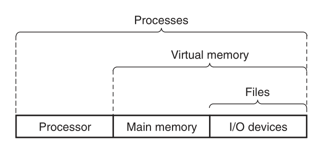
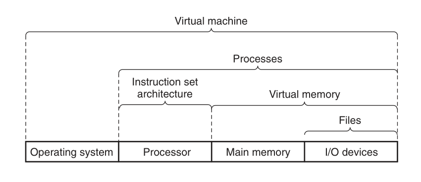
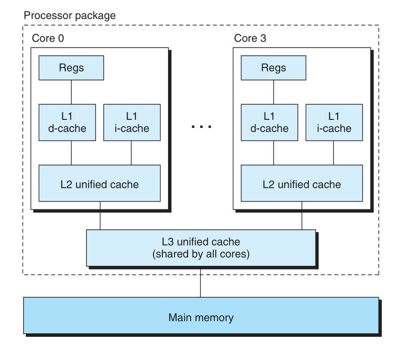

# 第一章和第二章

CS:APP 学习过程记录

文中的插图出自 Computer Systems: A Programmer's Perspective, 3/E (CS:APP3e). 版权归原作者所有.

#### 编译系统流程

编译的过程记录在 [基本编译操作](https://github.com/jinmiaoluo/cplay/blob/master/example-1-basic-compilation-operations)

如何用 GDB 调试见: [基本调试步骤](https://github.com/jinmiaoluo/cplay/tree/master/example-2-basic-debug-step)

#### 大端小端

我们现在常用的 PC (Intel 或者 AMD)是小端形式存放的二进制.

保存一个比较大的整数的二进制时, 假设该整数是: 4142. 这个数的十六进制是: 0x102e. 大端小端的区别就是二进制表示这个整数. 高位的数是按照人的自觉那样, 高位在前低位在后表示(大端). 还是低位在前高位在后(小端).

大端: 该整数的表示顺序是 `10 2e`
小端: 该整数的表示顺序是 `2e 10`

#### 关于操作系统

操作系统的主要作用:

1. 防止软件对硬件的滥用
2. 提供统一和简单的机制来使用硬件

操作系统上的软件与硬件(即从软件的角度, 如果要访问这些硬件, 这些硬件相当于什么):
- I/O 设备: 文件
- 主存和 I/O 设备: 虚拟内存地址
- 处理器和主存和 I/O 设备: 进程

#### 关于字长(word size)

字长用于表示指针数据的大小. 一个最重要的作用是表示最大的虚拟地址空间的大小. 常见的 64 位系统和 32 位系统中的 `64` 和 `32` 表示的就是字长的大小.

#### 虚拟内存

操作系统提供的内存和 I/O 设备的抽象. 让进程以为自己独占了整个主存(虚拟地址空间). 主要的思路是: 将进程的虚拟内存存放到硬盘. 然后通过主存作为缓存. 操作系统通过复杂的交互. 实现虚拟地址空间内的虚拟地址到真实的物理地址的转换.

#### 缓存与抽象

关于缓存:

作用: 上级设备更快成本更高. 容量也比较小. 缓存的目的是通过总线将数据从低速设备复制到高速设备. 从而加速数据的读写.

PS: 互联网通信也可以被看作是 I/O 设备.

关于抽象(操作系统的层面):

作用: 在操作系统上通过抽象来隐藏硬件的复杂度. 从而实现统一且简单的使用硬件的方法.

#### CPU

#### 进程与线程

进程有自己独立的上下文(内存地址空间中的数据).
线程共享了进程的上下文

- TODO: 为何线程可以提高性能.

#### 并行与并发

- TODO: 不是很理解. 粗浅的理解: 并行是同时的. 有两套物理资源同时做两件事. 并发是交替执行的. 只有一套物理资源. 交替的做两件事.

##### 什么是超线程技术

- TODO: 不是很理解. 粗浅的理解: 通过提供特定硬件(两份). 从而让一个CPU核心有选择性的将两个可以同时执行的进程进行同时的执行.

#### 类型的作用

二进制往往是以字节为单位的. 类型是通过编译器来确定多个(类型的目的是表示 size)字节的二进制组合来表示一个数据.

#### 有符号数与无符号数

通过将特定类型的最高为作为符号位来表示正负. 比如 `1000,0000` 中的最高为的 `1` 表示的就是负数. 其值是 `-1` * `最高为的值` + `其他位的值`. 这种表示负数的方式叫做补码.

#### 逻辑右移

如果一个值是有符号类型. 那么当最高为为 `1` 时. 比如 `1000,0000`. 如果要执行右移 `2` 位. 则高位要补 `1` 而不是 `0`. 结果是 `1110,0000`(而不是 `0010,0000`).

这样做可以保证有符号值依旧满足右移一位等于算术的除以 `2` 的目的.

#### 乘法除法实现

- TODO:
- 乘法的思路是什么.
- 除法的思路是什么.

#### 算术与溢出

算术溢出与有符号类型有关.

- TODO:
- 加法算术溢出的原因.
- 乘法算术溢出的原因.
- 除法算术溢出的原因.
- 位移溢出的原因.

#### 浮点数

在有限的二进制位内, 通过浮动的二进制小数点的位置, 尽可能表示一个精确的小数(精度层面). 见: [CMU视频-P4](https://www.bilibili.com/video/BV1iW411d7hd?p=4)第 06:51 时的解释

- TODO:
- 单精度浮点数的编码实现.
- 双精度浮点数的编码实现.

#### 一些技巧

##### 如何记住十六进制到十进制的关系

记住 `A` `C` `F` 对应的十进制的值. `B` 等于 `A` 加 1. `D` 等于 `C` 加 1. `E` 等于 `F` 减 1.

##### 如何记住 ASCII 中数字零到九的十六进制编码

`0-9` 的 ASCII 十六进制刚好是 `0x30-0x39`

#### 题解

- TODO: 编辑并运行题目和代码. 亲自执行一遍
